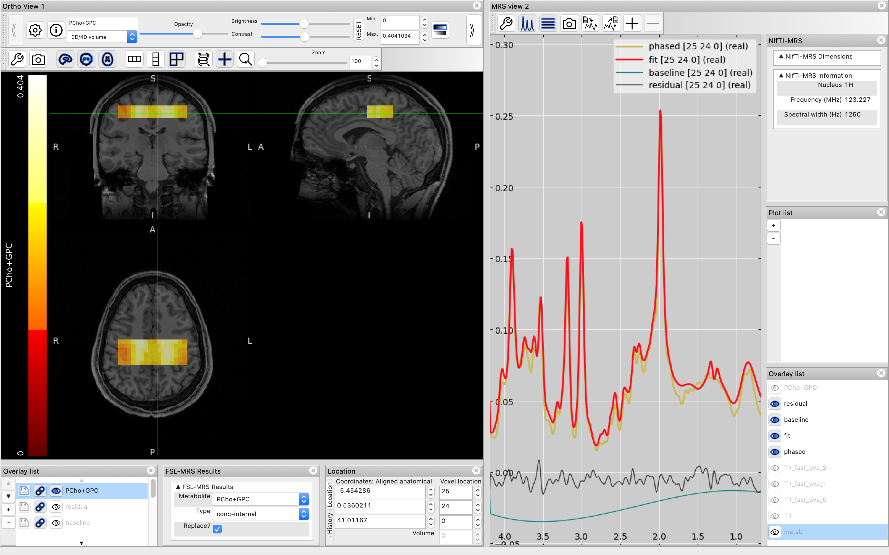

# The NIfTI-MRS data standard repository

This is a repository to store information and code associated with the efforts to define an in vivo magnetic resonance spectroscopy (MRS) NIfTI data format.

[Documentation for the format is available online.](https://wexeee.github.io/mrs_nifti_standard/)

## Why?
Users of MRS and magnetic resonance spectroscopic imaging (MRSI) are faced with numerous data formats. Often vendor-specific expertise is needed to interpret, reconstruct, and analyse MRS data. Other users rely on disparate software, with inconsistent implementations. Furthermore, there is no accepted format for sharing or storing spectral data. Researchers cannot easily interpret data processed in another laboratory, nor can data be made “open” in a consistent format.

## Why NIfTI?
NIfTI has been chosen due to its simplicity, availability of supporting libraries, ubiquity in the neuroimaging community, and extensive pre-existing support. Moreover, the results of spectral fitting can trivially be stored as unmodified NIfTI images. As a result data, results, and associated imaging can all be held and viewed using a single format.

## NIfTI-MRS
The provisional format specification can be found in this repository as a markdown file (specification.md) and at [zenodo](https://doi.org/10.5281/zenodo.5084789)

A discussion on the format is ongoing at the [MRSHub forums](https://forum.mrshub.org/t/nifti-mrs-discussion-thread/443). Note that this thread has been split off from a longer one on the proposed [MRS BIDS format](https://forum.mrshub.org/t/bids-for-spectroscopy/83/42). We are also holding regular meetings, get in contact via the MRSHub discussion or email if you would like to get involved.

## Conversion of data to NIfTI-MRS
Conversion of data can be carried out manually, but a separate project, [spec2nii](https://github.com/wexeee/spec2nii/tree/master/spec2nii), can be used for automatic conversion of data to the format.

### spec2nii supported formats
To see an up-to-date list of formats supported by spec2nii, see the [spec2nii README](https://github.com/wexeee/spec2nii/blob/master/README.md).

The following table also summaries those formats supported.

| Format        | File extension | SVS | CSI | Automatic orientation |
|---------------|----------------|-----|-----|-----------------------|
| Siemens Twix  | .dat           | Yes | No  | Yes                   |
| Siemens DICOM | .ima / .dcm    | Yes | Yes | Yes                   |
| Philips       | .SPAR/.SDAT    | Yes | No  | Yes                   |
| Philips       | .data/.list    | Yes | No  | Yes                   |
| Philips DICOM | .dcm           | Yes | No  | Yes (WIP)             |
| GE            | .7 (pfile)     | Yes | Yes | Yes                   |
| UIH DICOM     | .dcm           | Yes | Yes | Yes                   |
| Bruker        | 2dseq          | Yes | Yes | Yes                   |
| Bruker        | fid            | Yes | Yes | Yes (WIP)             |
| Varian        | fid            | Yes | No  | No (WIP)              |
| LCModel       | .RAW           | Yes | No  | No                    |
| jMRUI         | .txt           | Yes | No  | No                    |
| jMRUI         | .mrui          | Yes | No  | No                    |
| ASCII         | .txt           | Yes | No  | No                    |

## Visualisation of NIfTI-MRS

*MRSI data stored as NIfTI-MRS displayed in FSLeyes alongside metabolite maps and spectral fits.*

The NIfTI-MRS format can be viewed using the free NIfTI visualiser [FSLeyes](https://fsl.fmrib.ox.ac.uk/fsl/fslwiki/FSLeyes). A [plugin](https://git.fmrib.ox.ac.uk/wclarke/fsleyes-plugin-mrs) developed by the standard's authors extends FSLeyes to:
- interpret the higher dimensions of NIfTI-MRS,
- provide information about the NIfTI-MRS headers, and
- enable interactive phasing of spectral data.

## Analysis packages supporting NIfTI-MRS
This is a list of MRS analysis packages that are known to support NIfTI-MRS
- FSL-MRS
- Osprey (WIP)

Minimal examples of interpreting NIfTI-MRS in are contained in Java, Python, MATALB, and R are included in the minimal_examples folder.

## This Repository
The repository currently holds:
- An up-to-date copy of the format specification
- A set of example data, including those referred to by the specification.
- Original data from which examples are generated and code for generation (in jupyter notebook format).
- Links (via git submodules) to repositories containing minimal examples in java, matlab, python, and R.
- Manuscript, supporting information, figures, and figure generation code for the associated publication.

All data is tracked using git LFS.

### Requirements
To run the included python jupyter notebooks you will need:
- spec2nii
- pymapvbvd
- nibabel
- jupyter
- numpy
- h5py
- fsl-mrs

We recommend using conda to download the packages, and using python >=3.7.

```
    conda install \
    -c conda-forge \
    -c defaults\
    -c https://fsl.fmrib.ox.ac.uk/fsldownloads/fslconda/channel/ \
    jupyterlab pymapvbvd nibabel numpy h5py spec2nii fsl-mrs```


